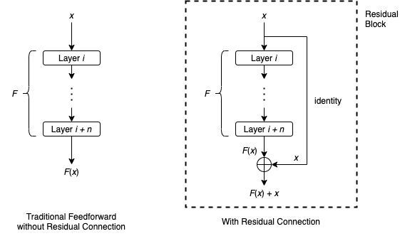
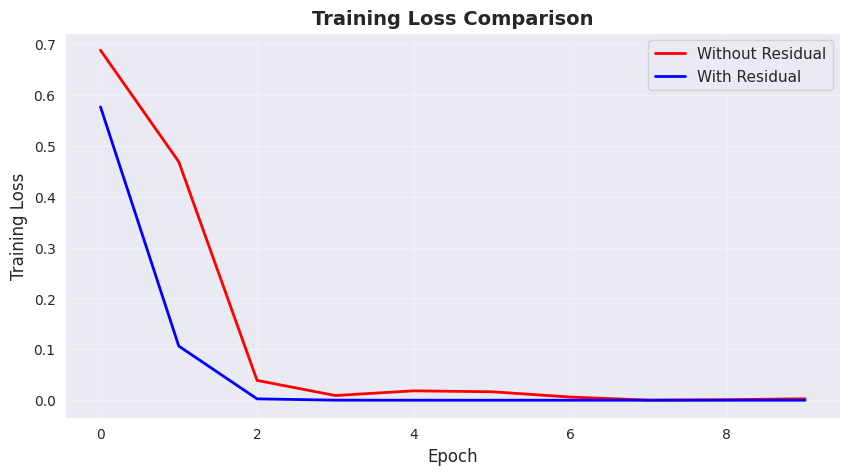

<h1 align="center">Residual Networks and Skip Connections</h1>

Demonstrating the importance of residual networks in practice

Image Credit: Wanshun Wong

## Objective

Residual connections also known as *skip connections* are a core architectural idea in modern deep learning. They were popularized by **[ResNet](https://arxiv.org/pdf/1512.03385)**, and today they appear in almost every state-of-the-art model, including **Transformers, U-Net, Diffusion Models, and BERT**.

The key idea is simple:
*Instead of forcing every layer to learn a full transformation, we let layers learn only the difference (the "residual") from the identity.*

This greatly improves gradient flow, stabilizes very deep networks, and allows models to scale to hundreds of layers.

**Objective of this project:**
My objective is to build a *simple, minimal neural network* - one with residual connections and one without and then visualize and understand how skip connections influence optimization and training behavior.

## Approach

To keep computation light, I generated a **synthetic dataset** where sequences are classified based on the frequency range of the tokens they contain.

### Workflow

1. **Generate synthetic frequency-based sequences**

   * Class 0 → more *low-frequency* tokens
   * Class 1 → more *high-frequency* tokens

2. **Build two text classifiers using PyTorch**

   * **Model A:** Deep feed-forward network *(no residual connections)*
   * **Model B:** Same architecture but with **ResidualBlocks** added

3. **Train both models on a small dataset**

   * Used only **500 samples** for quick experimentation
   * Applied average pooling over sequence embeddings
   * Trained each model for 10 epochs

### Note

In practice, residual connections are **not** usually added after *every* layer.
Instead, they are applied after **a block of layers**, often with normalization and multiple linear transformations.

For simplicity, what I did was add one residual block after each layer so the effect is easier to observe.

## Result

Both models eventually learn the simple synthetic task.
However, the model **with residual connections** trains:

* Faster
* More stably
* With lower final loss

<i>
Training loss comparison between models with and without residual connections.
</i>

Even though the dataset is tiny and the difference looks small, on *real* large-scale datasets, these differences become dramatic - as seen in ResNet-50, Transformers, and other modern architectures.
